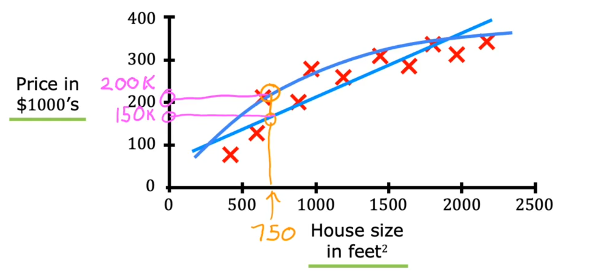
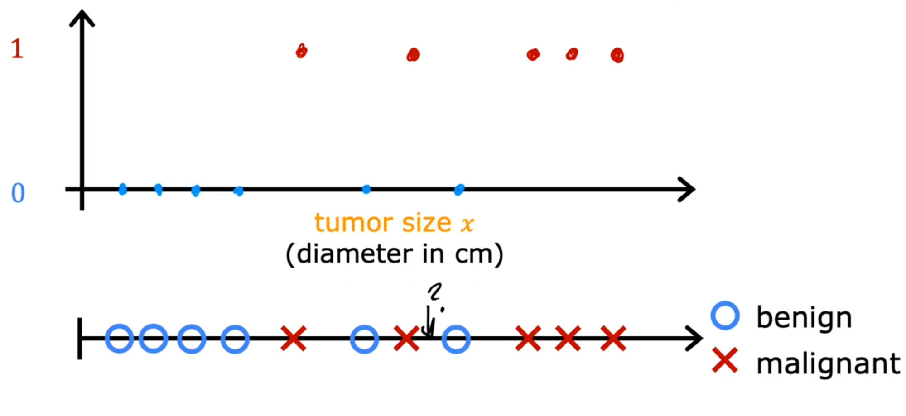
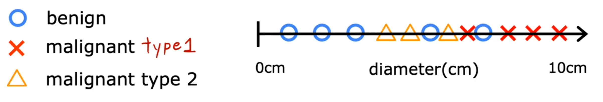
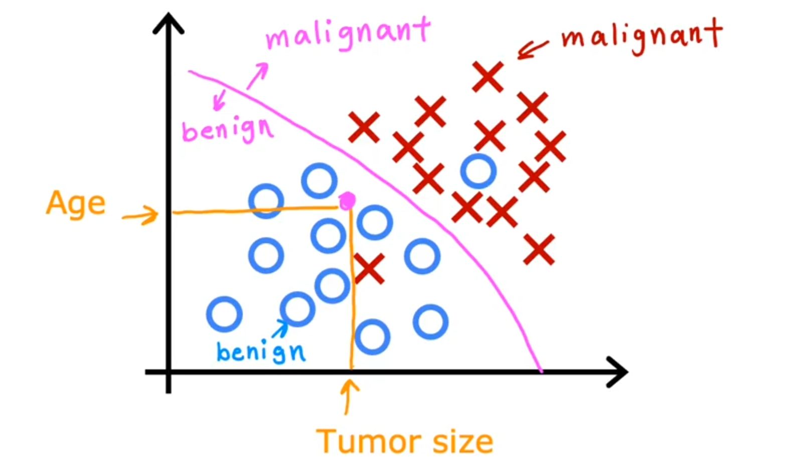
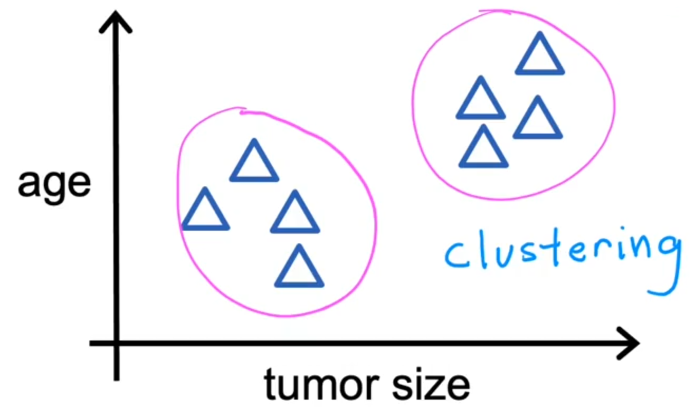

# Week 1 Notes

## Module 1: Supervised vs Unsupervised Learning

### 1.1 What is Machine Learning?

#### Definition

**Arthur Samuel's Definition**: "The field of study that gives computers the ability to learn without being explicitly programmed"

#### Key Example

- Samuel's checkers program (1950s)
- Computer learned by playing thousands of games against itself
- Identified winning/losing positions through experience
- Became better than Samuel himself

#### Core Principle

More training opportunities → Better performance

#### Two Main Types

1. **Supervised Learning** - Most widely used in real-world applications
2. **Unsupervised Learning** - Second most common type

#### Course Structure

- Courses 1-2: Supervised Learning
- Course 3: Unsupervised Learning, Recommender Systems, Reinforcement Learning

---

### 1.2 Supervised Learning

#### Definition

Learning algorithm that maps **inputs (x)** to **outputs (y)**:

$$
input(x)→f(⋅)→output(y)
$$

Where $f(⋅)$ is the learning algorithm.

**Key Characteristic**: Training with labeled examples (correct input-output pairs)

#### Applications

| Application         | $Input(x)$        | →   | $Output(y)$            |
| ------------------- | ----------------- | --- | ---------------------- |
| Spam Filtering      | email             | →   | spam? (0/1)            |
| Speech Recognition  | audio             | →   | text transcripts       |
| Machine Translation | English           | →   | Spanish                |
| Online Advertising  | ad, user info     | →   | click? (0/1)           |
| Self-driving Car    | image, radar info | →   | position of other cars |
| Visual Inspection   | image of phone    | →   | defect?(0/1)           |

---

#### Type 1: Regression

**Predicts continuous numerical values from infinitely many possibilities**

#### Example: Housing Price Prediction



- **Input (x)**: House size (sq ft)
- **Output (y)**: Price ($)
- Can fit straight line or curve to data
- Predicts any number (e.g., $150,000, $183,000, $200,000)

**Mathematical representation**: $y = f(x)$ where $y \in \mathbb{R}$

---

#### Type 2: Classification

**Predicts discrete categories from a small, finite set of possibilities**

#### Example: Breast Cancer Detection

- **Input (x)**: Tumor size
- **Output (y)**: Benign (0) or Malignant (1)

| Size | Diagnosis |
| ---- | --------- |
| 2    | 0         |
| 5    | 1         |
| 1    | 0         |
| 7    | 1         |
| ⋮    | ⋮         |



- Can have >2 categories (e.g., Type 0, Type 1, Type 2 cancer)



**Key Difference from Regression**:

- Classification: Small finite set of categories
- Regression: Infinitely many possible numbers

#### Multiple Input Features

Can use multiple inputs simultaneously:



- Tumor size AND patient age
- Algorithm finds decision boundary separating categories
- Real applications use many features (thickness, uniformity, cell size, etc.)

**Mathematical representation**: $y \in \{0, 1\}$ or $y \in \{0, 1, 2, ..., n\}$

---

### 1.3 Unsupervised Learning

#### Definition

Given data with **only inputs (x)**, no output labels (y)

**Goal**: Find structure, patterns, or interesting relationships in data

---

#### Type 1: Clustering

**Groups similar data points together automatically**



##### Applications

**1. Google News**

- Groups related articles together
- Finds common words (e.g., "panda," "twin," "zoo")
- Adapts to new topics daily without human supervision

**2. DNA/Genetic Data Analysis**

- Groups individuals by genetic similarities
- Identifies "types" of people based on gene expression
- No predefined categories

**3. Market Segmentation**

- Groups customers by behavior/motivation
- Example: Knowledge seekers, Career developers, Industry updaters
- Enables targeted marketing strategies

---

#### Type 2: Anomaly Detection

**Detects unusual events or outliers**

#### Applications

- Fraud detection in financial systems
- Identifying unusual transactions
- Security monitoring

---

#### Type 3: Dimensionality Reduction

**Compresses large datasets while preserving information**

- Reduces data size
- Maintains essential patterns
- Improves computational efficiency

---

### Key Comparisons

| Aspect       | Supervised Learning         | Unsupervised Learning         |
| ------------ | --------------------------- | ----------------------------- |
| **Data**     | $Inputs (x)$ + $Labels (y)$ | Only $inputs (x)$             |
| **Goal**     | Predict $y$ for new $x$     | Find patterns/structure       |
| **Examples** | Regression, Classification  | Clustering, Anomaly detection |
| **Training** | Learn from "right answers"  | Discover hidden structure     |

---

### Machine Learning Categories

```ascii
Machine Learning
│
├── Supervised Learning (learns from labeled data: x → y)
│   │
│   ├── Regression
│   │   ├── Predicts continuous numerical values
│   │   └── Examples: Housing prices, Temperature, Stock prices
│   │
│   └── Classification
│       ├── Predicts discrete categories
│       └── Examples: Spam detection, Disease diagnosis, Image recognition
│
└── Unsupervised Learning (finds patterns in unlabeled data: x only)
    │
    ├── Clustering
    │   ├── Groups similar data points
    │   └── Examples: Customer segmentation, News grouping, DNA analysis
    │
    ├── Anomaly Detection
    │   ├── Identifies unusual patterns/outliers
    │   └── Examples: Fraud detection, System monitoring
    │
    └── Dimensionality Reduction
        ├── Compresses data while preserving information
        └── Examples: Feature extraction, Data visualization
```

---

### Summary

#### Supervised Learning

- **Regression**: Predict continuous numbers (housing prices, temperature)
- **Classification**: Predict categories (spam/not spam, disease diagnosis)

#### Unsupervised Learning

- **Clustering**: Group similar data (news articles, customer segments)
- **Anomaly Detection**: Find unusual patterns (fraud detection)
- **Dimensionality Reduction**: Compress data efficiently

#### Best Practice

Success requires both:

1. Understanding the algorithms (tools)
2. Knowing how to apply them effectively (practical skills)

## Module 2: Linear Regression Model - Study Notes

### Linear Regression Overview

**Definition**: A supervised learning method that fits a straight line to data to predict continuous numerical outputs.

**Key Characteristics**:

- Most widely used learning algorithm
- Predicts numbers (e.g., house prices, temperatures)
- Uses labeled training data with "right answers"

#### Regression vs Classification

| Regression                       | Classification                  |
| -------------------------------- | ------------------------------- |
| Predicts continuous numbers      | Predicts discrete categories    |
| Infinitely many possible outputs | Small, finite set of outputs    |
| Example: Price prediction        | Example: Cat vs Dog recognition |

### Training Data Notation

**Standard notation used throughout machine learning**:

- **$x$** = Input variable/feature (e.g., house size)
- **$y$** = Output variable/target (e.g., house price)
- **$m$** = Total number of training examples
- **$(x^{(i)}, y^{(i)})$** = $i^{th}$ training example
  - Note: Superscript $(i)$ is an index, NOT exponentiation

**Example**: First training example: $(x^{(1)}, y^{(1)}) = (2104, 400)$

### The Model Function

**Standard form**:
$$f_{w,b}(x) = wx + b$$

Or simplified as: $f(x) = wx + b$

**Components**:

- **$w$** = Weight/coefficient (determines slope)
- **$b$** = Bias/y-intercept (where line crosses y-axis)
- **$\hat{y}$** = Predicted value (output of model)
- **$y$** = Actual true value (from training set)

**Alternative names**:

- Linear regression with one variable
- Univariate linear regression (uni = one, variate = variable)

### Cost Function

**Purpose**: Measures how well the model fits the training data

**Formula** (Squared Error Cost Function):
$$J(w,b) = \frac{1}{2m} \sum_{i=1}^{m} (f_{w,b}(x^{(i)}) - y^{(i)})^2$$

Or equivalently:
$$J(w,b) = \frac{1}{2m} \sum_{i=1}^{m} (\hat{y}^{(i)} - y^{(i)})^2$$

**Key points**:

- Computes average squared error across all training examples
- Division by $2m$ (instead of just $m$) simplifies later calculations
- Most commonly used cost function for regression problems

#### How Cost Function Works

1. For each training example: compute error = $f(x^{(i)}) - y^{(i)}$
2. Square each error
3. Sum all squared errors
4. Divide by $2m$ to get average

**Goal**: Find values of $w$ and $b$ that minimize $J(w,b)$

### Visualizing the Cost Function

**For simplified model** ($f_w(x) = wx$, where $b=0$):

- Each value of $w$ creates a different line
- Each line has a corresponding cost $J(w)$
- Plotting $J(w)$ vs $w$ shows a parabola
- Minimum occurs where line best fits data

**For full model** ($f_{w,b}(x) = wx + b$):

- Cost function is 3D surface or contour plot
- Each point $(w, b)$ corresponds to a specific line and its cost
- Better fitting lines have lower costs (closer to center of contour plot)
- Goal: Find $(w, b)$ at the minimum of this surface

### Key Insights

- Small $J$ = Good fit to training data
- Large $J$ = Poor fit to training data
- Manual parameter selection is impractical
- Need automatic algorithm to find optimal $w$ and $b$
- **Next step**: Gradient descent algorithm (covered in next module)

### Important Terminology Summary

- **Training set**: Data used to train the model
- **Parameters**: $w$ and $b$ (adjusted during training)
- **Hypothesis/Model**: The function $f$ that makes predictions
- **Cost function**: $J(w,b)$ - measures prediction error
- **Minimize**: Find parameters that give smallest cost
